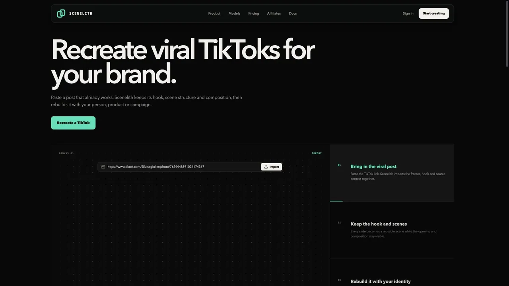
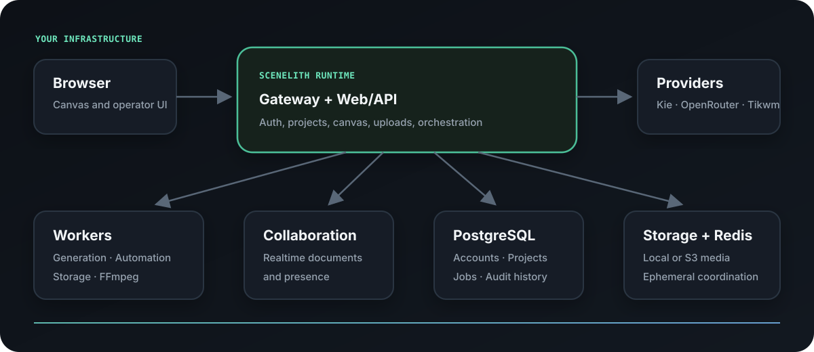

<div align="center">
  
  <h1>Scenelith</h1>
  <p><strong>Create, edit, and automate AI image and video on one visual canvas.</strong></p>
  <p>Source-available · Self-hosted · Your infrastructure · Your provider keys</p>
  <p>
    <a href="https://github.com/Scenelith/scenelith/actions/workflows/runtime.yml"></a>
    <a href="https://github.com/Scenelith/scenelith/releases"></a>
    <a href="LICENSE.md"></a>
  </p>
  <p>
    <a href="https://scenelith.com">Website</a> ·
    <a href="https://github.com/Scenelith/scenelith/discussions">Discussions</a> ·
    <a href="docs/SELF_HOSTING.md">Self-hosting guide</a>
  </p>
</div>



<p align="center"><a href="docs/assets/readme/scenelith-five-workflows.mp4">Watch the full-resolution 30 fps product tour →</a></p>

Scenelith keeps the source, references, prompts, generations, edits, and reusable identities connected instead of scattering a creative workflow across separate tools. Import a proven format, rebuild it with your own character or brand, compare every output, and continue editing on the same canvas.

## What you can do

- Generate and edit images and video with visual reference connections.
- Import TikTok slideshows and video, detect scenes, and keep the source context visible.
- Save people and characters as reusable single or Before/After identities.
- Build longer video sequences in Video Master without losing per-scene versions.
- Automate repeatable content workflows while keeping every intermediate result editable.
- Run the complete product on your own server with your own storage and provider accounts.

## Run it yourself

You need Docker Engine, Docker Compose 2.20.3 or newer, 4 CPU cores, 8 GB RAM, and at least 10 GB of free disk space. Git, Node.js, npm, and a source checkout are not required.

```bash
curl -fsSL https://github.com/Scenelith/scenelith/releases/latest/download/install.sh | sh
```

Add the provider keys you intend to use to `scenelith/deploy/selfhost/.env`:

```dotenv
KIE_API_KEY=
OPENROUTER_API_KEY=
```

Then start the configured services and open <http://localhost>:

```bash
cd scenelith
./scenelith restart
```

The first account becomes the instance owner, and public registration closes by default. For domains, automatic HTTPS, S3-compatible storage, backups, upgrades, rollback, and the complete service topology, read the [self-hosting guide](docs/SELF_HOSTING.md).

<details>
<summary><strong>Inspect the installer before running it</strong></summary>

```bash
curl -fsSLO https://github.com/Scenelith/scenelith/releases/latest/download/install.sh
less install.sh
sh install.sh
```

The installer downloads the latest release bundle, verifies its SHA-256 checksum and internal manifest, creates `./scenelith`, generates unique private secrets, validates Docker, and starts the stack from pinned images. It refuses to overwrite a non-empty installation directory.

</details>

<details>
<summary><strong>Build the checked-out source</strong></summary>

Contributors need Git and Node.js 24 in addition to Docker:

```bash
git clone https://github.com/Scenelith/scenelith.git
cd scenelith
npm ci
./scenelith init
npm run selfhost:up:source
```

The source checkout and release bundle resolve the same Compose model. The only difference is whether the application image is pulled from the release or built locally.

</details>

## Providers and privacy

Provider keys stay in the server environment. They are sent only to the provider they authenticate against and are never returned to the browser or sent to Scenelith.

| Provider | Used for | Data sent |
| --- | --- | --- |
| **Kie** | Image and video generation and editing | Kie key, prompts, settings, and request reference media |
| **OpenRouter** | Assistant, automation planning, and visual text analysis | OpenRouter key and the prompt or media required by the selected model |
| **Tikwm** | Resolving public TikTok posts during import | TikTok URL; Tikwm returns post metadata and direct media URLs |
| **S3-compatible storage** | Optional operator-owned media storage | Media and object metadata configured by the operator |

TikTok import does not use a logged-in TikTok account or TikTok cookies. Video scene detection, thumbnails, and timeline sprites are processed locally with FFmpeg after download. The self-hosted interface makes no automatic request to a Scenelith media server.

## Portable projects and recipes

Canvas projects can be exported as a versioned `.scenelith.json` document and imported into another instance. Portable documents contain graph structure and safe settings, but never instance IDs, stored media URLs, generated outputs, or credentials.

The [`recipes/`](recipes) directory contains small, reviewable workflow examples. A recipe is an ordinary portable Scenelith document: fork it, improve it, or contribute a new one with the media and provider requirements documented in its pull request.

## Architecture and operations



The release bundle contains deployment files and a thin launcher, not a second product implementation. Web, workers, migrations, and realtime collaboration use one attested, versioned, multi-architecture image with different commands.

Your server runs:

- the Scenelith web application and API;
- generation, automation, and storage workers;
- realtime collaboration;
- PostgreSQL and Redis;
- local persistent media storage, with optional S3-compatible storage;
- Caddy with automatic HTTPS for public domains;
- database migrations, backup/restore tools, and an installation doctor.

The public runtime has no payment service, hosted-account dependency, account-email service, or license server. Its instance owner signs in directly after local registration; email confirmation and email-based password recovery are Cloud-only services.

### Updates and data safety

```bash
./scenelith backup
./scenelith update
```

The updater verifies the new release bundle, creates a checksummed backup, preserves the environment and Docker volumes, applies ordered migrations, and waits for every service to become healthy. If startup fails, it restores the previous deployment files and image. Pin a reviewed release with `./scenelith update 1.2.3`.

Restore only from a verified backup and only with explicit confirmation:

```bash
./scenelith restore --from /absolute/path/to/backup --confirm
```

Never edit an applied migration or run `docker compose down -v` unless permanent data deletion is intentional.

## Community and contributions

- Ask setup and workflow questions in [Discussions](https://github.com/Scenelith/scenelith/discussions).
- Report defects or request features through the [issue forms](https://github.com/Scenelith/scenelith/issues/new/choose).
- Read [CONTRIBUTING.md](CONTRIBUTING.md) before opening a pull request.
- Report vulnerabilities privately as described in [SECURITY.md](SECURITY.md).

Community changes merge directly into this canonical repository after review, CLA verification, tests, build, and the public-boundary audit. The hosted Scenelith product consumes this public core as an extension; maintainers do not maintain a second copy of shared product code.

## License

Scenelith is **source-available**, not OSI open source. The [Sustainable Use License](LICENSE.md) allows internal business, non-commercial, and personal use and modification. It does not allow selling Scenelith or offering it as a competing hosted service. Brand use is covered by [TRADEMARKS.md](TRADEMARKS.md).

The repository boundary and hosted-extension model are documented in [Distribution architecture](docs/DISTRIBUTION_ARCHITECTURE.md).
